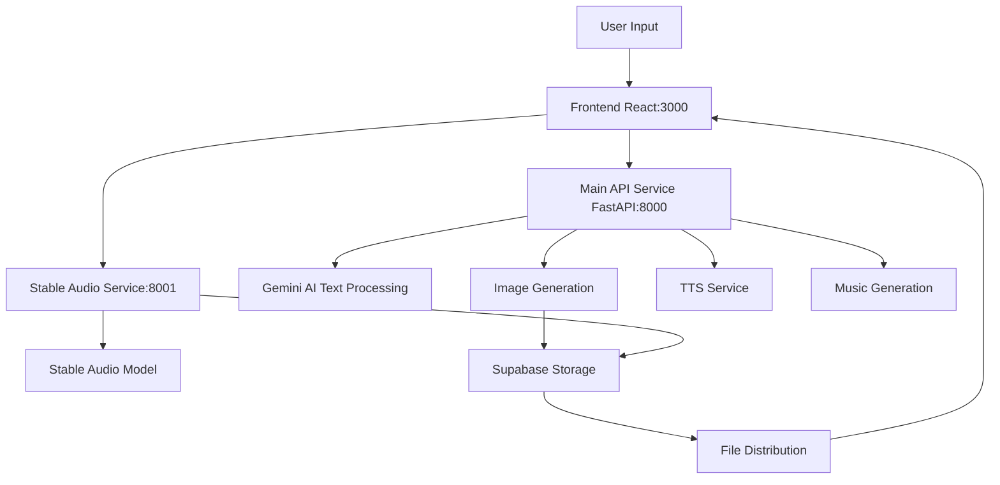

# Nightingale - Let Sound Touch the Soul

> AI-powered personalized soundscape platform that transforms emotions and inspirations into immersive audio experiences

## 🌟 Overview

Nightingale is an innovative AI-powered platform that generates highly personalized, real-time soundscapes based on user descriptions. Using advanced AI models including Gemini and Stable Audio, it creates immersive audio experiences for focus, creativity, meditation, and relaxation.

## ✨ Features

- **AI-Powered Generation**: Uses Gemini AI for text processing and Stable Audio for high-quality sound generation
- **Multiple Modes**: Support for Focus, Creative Flow, Mindful Escape, Sleep, Story, and ASMR modes
- **Real-time Processing**: Fast audio generation with progress tracking
- **Interactive UI**: Modern React-based interface with intuitive controls
- **Audio Player**: Built-in player with background image support
- **Sharing**: Easy sharing of generated soundscapes
- **Cross-platform**: Web-based application accessible from any device

## 🏗️ Architecture

```
Nightingale/
├── ambiance-weaver-react/     # Frontend React application
├── backend/                   # Python FastAPI backend
│   ├── app/                  # Main application code
│   ├── scripts/              # Utility scripts
│   ├── venv_gemini/         # Gemini AI virtual environment
│   └── venv_stableaudio/    # Stable Audio virtual environment
├── docs/                     # Documentation
├── scripts/                  # Project scripts
└── venv_stableaudio/        # Root level Stable Audio environment
```

## 🏛️ Architecture Solution

### System Components

Nightingale uses a microservices architecture with the following core components:

#### 1. **Frontend Layer**
- **Tech Stack**: React 18 + TypeScript + Material-UI v5.15.11
- **Function**: User interface, interaction logic, state management
- **Deployment**: Static file service, deployable to CDN
- **Port**: 3000 (development)

#### 2. **Main API Service Layer**
- **Tech Stack**: FastAPI v0.116.0 + Gemini AI
- **Function**: 
  - User input processing and scene generation
  - Prompt generation and optimization
  - Image generation (Stability AI)
  - Text-to-Speech (Edge TTS)
  - Music generation
  - Story creation
  - Sharing functionality
- **Deployment**: Independent service, load balanced
- **Port**: 8000

#### 3. **Stable Audio Service Layer**
- **Tech Stack**: FastAPI + Stable Audio Tools v0.0.19
- **Function**: 
  - High-quality audio generation
  - Audio processing and optimization
  - Audio format conversion
- **Deployment**: Independent service, GPU accelerated
- **Port**: 8001

#### 4. **Storage Layer**
- **Tech Stack**: Supabase v2.16.0
- **Function**: 
  - Audio file storage
  - Image file storage
  - User data management
- **Deployment**: Cloud service, auto-scaling

### Data Flow



#### Data Flow Process:

1. **User Input Processing**
   ```
   User → Frontend → Main API Service → Gemini AI → Optimized Prompts
   ```

2. **Parallel Generation**
   ```
   Main API Service → Image Generation (parallel)
   Main API Service → TTS/Music Generation (parallel)
   Frontend → Stable Audio Service → Audio Generation (parallel)
   ```

3. **Result Integration**
   ```
   Images/Audio/Music → Supabase Storage → File Distribution → Frontend Player
   ```

### API Endpoints

#### Main API Service (Port 8000)
- `POST /api/generate-scene` - Scene generation
- `POST /api/generate-background` - Image generation
- `POST /api/generate-options` - Option generation
- `POST /api/create-story` - Story creation with TTS
- `POST /api/generate-music` - Music generation
- `POST /api/create-share` - Share creation
- `POST /api/edit-prompt` - Prompt editing
- `GET /api/share/{share_id}` - Get shared content

#### Stable Audio Service (Port 8001)
- `POST /api/generate-audio` - Audio generation
- `GET /health` - Health check

### Technical Stack

#### Frontend
- React 18, TypeScript, Material-UI v5.15.11
- Framer Motion v11.18.2, React Router DOM v6.22.1

#### Backend
- Python 3.11, FastAPI v0.116.0, Uvicorn v0.35.0
- Pydub v0.25.1, Supabase v2.16.0

#### AI Models & Services
- **Text Processing**: Google Gemini (gemini-2.5-flash, gemini-1.5-flash)
- **Audio Generation**: Stable Audio Tools v0.0.19, stable-audio-open-small
- **Text-to-Speech**: Edge TTS
- **Image Generation**: Stability AI
- **Deep Learning**: PyTorch v2.7.1, TorchAudio v2.7.1, Transformers v4.53.1

### Deployment Architecture

#### Development Environment
```
┌─────────────────┐    ┌─────────────────┐    ┌─────────────────┐
│   Frontend      │    │   Main API      │    │  Stable Audio   │
│   (Port 3000)   │◄──►│   (Port 8000)   │◄──►│   (Port 8001)   │
│   React Dev     │    │   FastAPI       │    │   FastAPI       │
│                 │    │   + Gemini      │    │   + Stable      │
│                 │    │   + Image Gen   │    │   Audio         │
│                 │    │   + TTS         │    │                 │
└─────────────────┘    └─────────────────┘    └─────────────────┘
```

#### Production Environment
```
┌─────────────────┐    ┌─────────────────┐    ┌─────────────────┐
│   Static Files  │    │   Load Balancer │    │   Stable Audio  │
│   Frontend      │◄──►│   Main API      │◄──►│   Service       │
│   (Web Server)  │    │   (Reverse      │    │   (CPU)         │
│                 │    │   Proxy)        │    │                 │
└─────────────────┘    └─────────────────┘    └─────────────────┘
                                │
                                ▼
                       ┌─────────────────┐
                       │   Supabase      │
                       │   Storage       │
                       │   (Cloud)       │
                       └─────────────────┘
```

### Technical Limitations

#### Audio Generation Constraints
- **Stable Audio Model**: Maximum 11-second audio clips
- **Solution**: Looping with crossfade for longer durations
- **Generation Time**: 10-20 seconds per audio generation

#### Model Capabilities
- **Complex Compositions**: Difficulty with multiple sound elements
- **Semantic Understanding**: Limited nuanced modifier processing
- **Quiet Sounds**: Challenges with low-amplitude generation

## 🚀 Quick Start

### Prerequisites

- Python 3.11 (required, not compatible with 3.12 or 3.13)
- Node.js 16+
- FFmpeg installed and in PATH

> **⚠️ Cross-Platform Compatibility**: This project has been updated for cross-platform deployment. For detailed instructions on Windows, Linux, and macOS deployment, see [Cross-Platform Deployment Guide](DEPLOYMENT_CROSS_PLATFORM.md).

### Installation

1. **Clone the repository**
   ```bash
   git clone https://github.com/yaxuanm/Nightingale.git
   cd Nightingale
   ```

2. **Set up backend environment**
   ```bash
   cd backend
   python -m venv venv_gemini
   # Windows:
   .\venv_gemini\Scripts\activate
   # Linux/macOS:
   # source venv_gemini/bin/activate
   pip install -r requirements-gemini-working.txt
   ```

3. **Set up Stable Audio environment**
   ```bash
   python -m venv venv_stableaudio
   # Windows:
   .\venv_stableaudio\Scripts\activate
   # Linux/macOS:
   # source venv_stableaudio/bin/activate
   pip install -r requirements-stable-audio.txt
   python scripts/stable_audio_fix.py
   ```

4. **Set up frontend**
   ```bash
   cd ../ambiance-weaver-react
   npm install
   ```

5. **Configure environment variables**
   ```bash
   # Copy and edit environment files
   cp backend/env.example backend/.env
   cp ambiance-weaver-react/env.example ambiance-weaver-react/.env
   ```

### Running the Application

1. **Start backend services**
   ```bash
   # Terminal 1: Main API (port 8000)
   cd backend
   # Windows:
   .\venv_gemini\Scripts\activate
   # Linux/macOS:
   # source venv_gemini/bin/activate
   python -m uvicorn app.main:app --host 0.0.0.0 --port 8000

   # Terminal 2: Stable Audio (port 8001)
   cd backend
   # Windows:
   .\venv_stableaudio\Scripts\activate
   # Linux/macOS:
   # source venv_stableaudio/bin/activate
   python -m uvicorn app.main_stable_audio:app --host 0.0.0.0 --port 8001
   ```

2. **Start frontend**
   ```bash
   cd ambiance-weaver-react
   npm start
   ```

3. **Access the application**
   - Frontend: http://localhost:3000
   - Main API: http://localhost:8000
   - Stable Audio: http://localhost:8001

## 🔧 Configuration

### Environment Variables

Create `.env` files in both `backend/` and `ambiance-weaver-react/` directories:

**Backend (.env)**
```env
GOOGLE_API_KEY=your-google-api-key
STABILITY_API_KEY=your-stability-api-key
HF_TOKEN=your-hugging-face-token
FFMPEG_PATH=C:\ffmpeg\bin
```

**Frontend (.env)**
```env
REACT_APP_GEMINI_API_URL=http://localhost:8000
REACT_APP_STABLE_AUDIO_API_URL=http://localhost:8001
REACT_APP_FRONTEND_URL=http://localhost:3000
```

## 📚 Documentation

- [Deployment Guide](DEPLOYMENT.md) - Complete deployment instructions
- [Cross-Platform Deployment](DEPLOYMENT_CROSS_PLATFORM.md) - Multi-OS deployment guide
- [Start Instructions](start_instructions.txt) - Detailed setup guide
- [Environment Setup](backend/README_ENVIRONMENTS.md) - Environment configuration

## 🛠️ Development

### Project Structure

- **Frontend**: React with TypeScript, Material-UI components
- **Backend**: FastAPI with async/await support
- **AI Services**: Gemini for text processing, Stable Audio for sound generation
- **Storage**: Supabase for cloud storage

### Key Components

- `ChatScreen.tsx` - Main interaction interface
- `Player.tsx` - Audio playback component
- `main.py` - Primary API endpoints
- `main_stable_audio.py` - Stable Audio service
- `ai_service.py` - AI integration layer

## 🚀 Deployment

For production deployment, see [DEPLOYMENT.md](DEPLOYMENT.md) for detailed instructions including:

- Environment setup
- Service configuration
- Performance optimization
- Troubleshooting guide

## 🤝 Contributing

1. Fork the repository
2. Create a feature branch
3. Make your changes
4. Test thoroughly
5. Submit a pull request

## 📄 License

This project is licensed under the MIT License for the application code.

**AI Model Licenses:**
- **Stable Audio**: Uses Stability AI Community License Agreement
  - Free for research, non-commercial, and limited commercial use (organizations with <$1M annual revenue)
  - Commercial licensing required for organizations with >$1M annual revenue
  - See [Stability AI License](https://huggingface.co/stabilityai/stable-audio-open-small/blob/main/LICENSE) for full terms

- **Google Gemini**: Subject to Google's API Terms of Service
  - Requires valid Google API key
  - Usage subject to Google's rate limits and terms

## 🙏 Acknowledgments

- [Google Gemini AI](https://ai.google.dev/) for text processing
- [Stability AI](https://stability.ai/) for audio generation
- React and FastAPI communities
- All contributors and testers

---

**Nightingale** - Let sound touch the soul 🎵