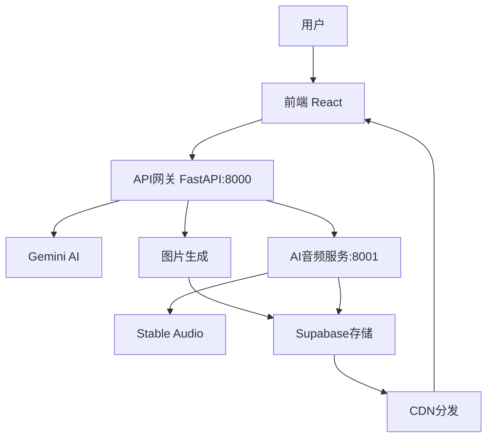

# Nightingale - Let Sound Touch the Soul

> AI-powered ambient sound generation platform that creates immersive audio experiences

## 🌟 Overview

Nightingale is an innovative AI-powered platform that generates ambient soundscapes based on user descriptions. Using advanced AI models including Gemini and Stable Audio, it creates immersive audio experiences that can help with relaxation, focus, and meditation.

## ✨ Features

- **AI-Powered Generation**: Uses Gemini AI for prompt understanding and Stable Audio for high-quality sound generation
- **Multiple Modes**: Support for different generation modes including story, focus, and ambient
- **Real-time Processing**: Fast audio generation with progress tracking
- **Interactive UI**: Modern React-based interface with intuitive controls
- **Audio Player**: Built-in player with background image support
- **Sharing**: Easy sharing of generated soundscapes
- **Cross-platform**: Web-based application accessible from any device

## 🏗️ Architecture

```
Nightingale/
├── ambiance-weaver-react/     # Frontend React application
├── backend/                   # Python FastAPI backend
│   ├── app/                  # Main application code
│   ├── scripts/              # Utility scripts
│   └── venv_gemini/         # Python virtual environment
├── docs/                     # Documentation
└── scripts/                  # Project scripts
```

## 🏛️ Architecture Solution

### System Components

Nightingale采用微服务架构，分为以下几个核心组件：

#### 1. **前端层 (Frontend Layer)**
- **技术栈**: React + TypeScript + Material-UI
- **功能**: 用户界面、交互逻辑、状态管理
- **部署**: 静态文件服务，可部署到CDN
- **端口**: 3000 (开发环境)

#### 2. **API网关层 (API Gateway Layer)**
- **技术栈**: FastAPI (Gemini API)
- **功能**: 
  - 用户输入处理
  - 提示词生成和优化
  - 图片生成
  - 任务协调
- **部署**: 独立服务，负载均衡
- **端口**: 8000

#### 3. **AI音频服务层 (AI Audio Service Layer)**
- **技术栈**: FastAPI + Stable Audio
- **功能**: 
  - 高质量音频生成
  - 音频处理和优化
  - 音频格式转换
- **部署**: 独立服务，GPU加速
- **端口**: 8001

#### 4. **存储层 (Storage Layer)**
- **技术栈**: Supabase
- **功能**: 
  - 音频文件存储
  - 图片文件存储
  - 用户数据管理
- **部署**: 云服务，自动扩展

### Component Interactions



#### 交互流程：

1. **用户输入处理**
   ```
   用户 → 前端 → API网关 → Gemini AI → 优化提示词
   ```

2. **并行生成**
   ```
   API网关 → 图片生成 (并行)
   API网关 → 音频服务 → Stable Audio (并行)
   ```

3. **结果整合**
   ```
   图片/音频 → Supabase存储 → CDN → 前端播放器
   ```

### Deployment Architecture

#### 开发环境 (Development)
```
┌─────────────────┐    ┌─────────────────┐    ┌─────────────────┐
│   Frontend      │    │   Gemini API    │    │  Stable Audio   │
│   (Port 3000)   │◄──►│   (Port 8000)   │◄──►│   (Port 8001)   │
│   React Dev     │    │   FastAPI       │    │   FastAPI       │
└─────────────────┘    └─────────────────┘    └─────────────────┘
```

#### 生产环境 (Production)
```
┌─────────────────┐    ┌─────────────────┐    ┌─────────────────┐
│   CDN/Static    │    │   Load Balancer │    │   GPU Cluster   │
│   Frontend      │◄──►│   API Gateway   │◄──►│   Audio Service │
│   (Nginx)       │    │   (Nginx)       │    │   (Docker)      │
└─────────────────┘    └─────────────────┘    └─────────────────┘
                                │
                                ▼
                       ┌─────────────────┐
                       │   Supabase      │
                       │   Storage       │
                       │   (Cloud)       │
                       └─────────────────┘
```

### Scalability Considerations

#### 1. **水平扩展**
- **前端**: 静态文件，CDN分发
- **API网关**: 多实例，负载均衡
- **音频服务**: GPU集群，任务队列

#### 2. **性能优化**
- **缓存策略**: Redis缓存热点数据
- **异步处理**: 长时间任务异步执行
- **资源池化**: 数据库连接池，GPU资源池

#### 3. **监控和日志**
- **应用监控**: Prometheus + Grafana
- **日志聚合**: ELK Stack
- **错误追踪**: Sentry

### Security Architecture

#### 1. **API安全**
- **认证**: JWT Token
- **授权**: Role-based Access Control
- **限流**: Rate Limiting

#### 2. **数据安全**
- **传输加密**: HTTPS/TLS
- **存储加密**: 数据库加密
- **密钥管理**: 环境变量 + 密钥管理服务

#### 3. **网络安全**
- **防火墙**: 端口限制
- **WAF**: Web应用防火墙
- **DDoS防护**: 流量清洗

## 🚀 Quick Start

### Prerequisites

- Python 3.11 (required, not compatible with 3.12 or 3.13)
- Node.js 16+
- FFmpeg installed and in PATH

### Installation

1. **Clone the repository**
   ```bash
   git clone https://github.com/yaxuanm/Nightingale.git
   cd Nightingale
   ```

2. **Set up backend environment**
   ```bash
   cd backend
   python -m venv venv_gemini
   .\venv_gemini\Scripts\activate
   pip install -r requirements-gemini-working.txt
   ```

3. **Set up Stable Audio environment**
   ```bash
   python -m venv venv_stableaudio
   .\venv_stableaudio\Scripts\activate
   pip install -r requirements-stable-audio.txt
   python scripts/stable_audio_fix.py
   ```

4. **Set up frontend**
   ```bash
   cd ../ambiance-weaver-react
   npm install
   ```

5. **Configure environment variables**
   ```bash
   # Copy and edit environment files
   cp backend/env.example backend/.env
   cp ambiance-weaver-react/env.example ambiance-weaver-react/.env
   ```

### Running the Application

1. **Start backend services**
   ```bash
   # Terminal 1: Gemini API (port 8000)
   cd backend
   .\venv_gemini\Scripts\activate
   python -m uvicorn app.main:app --host 0.0.0.0 --port 8000

   # Terminal 2: Stable Audio (port 8001)
   cd backend
   .\venv_stableaudio\Scripts\activate
   python -m uvicorn app.main_stable_audio:app --host 0.0.0.0 --port 8001
   ```

2. **Start frontend**
   ```bash
   cd ambiance-weaver-react
   npm start
   ```

3. **Access the application**
   - Frontend: http://localhost:3000
   - Gemini API: http://localhost:8000
   - Stable Audio: http://localhost:8001

## 🔧 Configuration

### Environment Variables

Create `.env` files in both `backend/` and `ambiance-weaver-react/` directories:

**Backend (.env)**
```env
GOOGLE_API_KEY=your-google-api-key
STABILITY_API_KEY=your-stability-api-key
HF_TOKEN=your-hugging-face-token
FFMPEG_PATH=C:\ffmpeg\bin
```

**Frontend (.env)**
```env
REACT_APP_GEMINI_API_URL=http://localhost:8000
REACT_APP_STABLE_AUDIO_API_URL=http://localhost:8001
REACT_APP_FRONTEND_URL=http://localhost:3000
```

## 📚 Documentation

- [Deployment Guide](DEPLOYMENT.md) - Complete deployment instructions
- [Start Instructions](start_instructions.txt) - Detailed setup guide
- [Environment Setup](backend/README_ENVIRONMENTS.md) - Environment configuration

## 🛠️ Development

### Project Structure

- **Frontend**: React with TypeScript, Material-UI components
- **Backend**: FastAPI with async/await support
- **AI Services**: Gemini for text processing, Stable Audio for sound generation
- **Storage**: Supabase for cloud storage

### Key Components

- `ChatScreen.tsx` - Main interaction interface
- `Player.tsx` - Audio playback component
- `main.py` - Primary API endpoints
- `main_stable_audio.py` - Stable Audio service
- `ai_service.py` - AI integration layer

## 🚀 Deployment

For production deployment, see [DEPLOYMENT.md](DEPLOYMENT.md) for detailed instructions including:

- Environment setup
- Service configuration
- Performance optimization
- Troubleshooting guide

## 🤝 Contributing

1. Fork the repository
2. Create a feature branch
3. Make your changes
4. Test thoroughly
5. Submit a pull request

## 📄 License

This project is licensed under the MIT License for the application code.

**AI Model Licenses:**
- **Stable Audio**: Uses Stability AI Community License Agreement
  - Free for research, non-commercial, and limited commercial use (organizations with <$1M annual revenue)
  - Commercial licensing required for organizations with >$1M annual revenue
  - See [Stability AI License](https://huggingface.co/stabilityai/stable-audio-open-small/blob/main/LICENSE) for full terms

- **Google Gemini**: Subject to Google's API Terms of Service
  - Requires valid Google API key
  - Usage subject to Google's rate limits and terms

## 🙏 Acknowledgments

- [Google Gemini AI](https://ai.google.dev/) for text processing
- [Stability AI](https://stability.ai/) for audio generation
- React and FastAPI communities
- All contributors and testers

---

**Nightingale** - Let sound touch the soul 🎵 