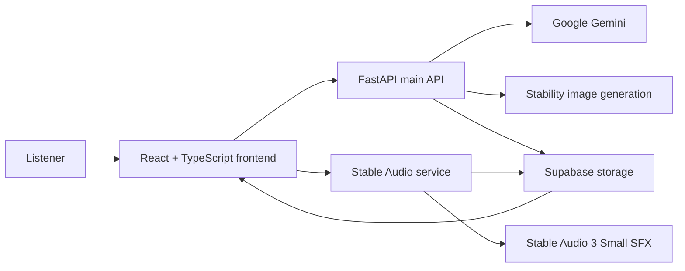

# Nightingale

Let sound touch the soul.

Nightingale is an AI-powered soundscape experience that turns a person's mood,
memory, or creative prompt into a personalized ambience. The product combines a
guided React interface, Gemini-powered prompt interpretation, Stable Audio 3
sound generation, image generation, playback, and shareable scene links.

Live portfolio build: https://yaxuanm.github.io/Nightingale/

Stable Audio 3 demo Space: https://huggingface.co/spaces/yaxuanmmmmm/nightingale-stable-audio-3-demo

## Product Concept

Most sound apps ask people to choose from a fixed catalog. Nightingale starts
from something more human: "I want the feeling of a warm summer evening at my
grandmother's house" or "I need a focused, rain-washed room for writing."

The app translates that intent into a playable soundscape and visual scene. It
is designed for focus, creative flow, mindful escape, sleep, storytelling, and
ASMR-style listening.

## What It Does

- Guided onboarding for selecting listening intent and emotional direction.
- Conversational prompt flow for describing a memory, scene, or mood.
- Gemini-based prompt refinement for scene, music, and story generation.
- Stable Audio 3 Small SFX integration for short ambience generation.
- Background image generation and an immersive audio player.
- Share links for generated experiences.
- Separate frontend, main API, audio generation, and storage layers so the demo
  can be deployed incrementally.

## Current Deployment

The portfolio frontend is deployed on GitHub Pages:

```text
https://yaxuanm.github.io/Nightingale/
```

The Stable Audio 3 demo has also been packaged as a Hugging Face Gradio Space:

```text
https://huggingface.co/spaces/yaxuanmmmmm/nightingale-stable-audio-3-demo
```

The Space is configured with the Stable Audio 3 Small SFX model and the required
Hugging Face secret. Hugging Face currently requires a PRO account to host a
personal ZeroGPU Space, so the public Space may remain on CPU unless GPU
hardware is enabled. The zero-cost portfolio strategy is to keep the frontend
public, use pre-generated audio samples for stable presentation, and run
real-time generation locally, on Colab, or on temporary GPU hardware for live
demos.

## Architecture


```mermaid
flowchart LR
    User["Listener"] --> Frontend["React + TypeScript frontend"]
    Frontend --> MainAPI["FastAPI main API"]
    Frontend --> AudioAPI["Stable Audio service"]
    MainAPI --> Gemini["Google Gemini"]
    MainAPI --> ImageGen["Stability image generation"]
    AudioAPI --> SA3["Stable Audio 3 Small SFX"]
    MainAPI --> Storage["Supabase storage"]
    AudioAPI --> Storage
    Storage --> Frontend
```

## Repository Structure

```text
Nightingale/
|-- ambiance-weaver-react/        # React portfolio app
|-- backend/                      # FastAPI services and AI integrations
|   |-- app/main.py               # Main API: scenes, stories, images, sharing
|   |-- app/main_stable_audio.py  # Audio generation API
|   `-- app/services/             # Gemini, Stable Audio, storage, media helpers
|-- deploy/huggingface-space/     # Gradio Space package for Stable Audio 3 demo
|-- docs/                         # Supporting demo and submission artifacts
|-- .github/workflows/            # GitHub Pages deployment
`-- DEPLOYMENT.md                 # Deployment notes and options
```

## Tech Stack

- Frontend: React 18, TypeScript, Material UI, Framer Motion, React Router.
- Backend: Python, FastAPI, Uvicorn, Pydub, Supabase.
- AI services: Google Gemini, Stable Audio 3 Small SFX, Stability image models,
  Edge TTS.
- Deployment: GitHub Pages for the frontend, Hugging Face Space for the audio
  demo package, optional GPU runtime for real-time generation.

## Stable Audio 3 Integration

The audio service now defaults to an official Hugging Face Space proxy:

```env
STABLE_AUDIO_PROVIDER=hf-space
STABLE_AUDIO_MODEL=stabilityai/stable-audio-3-small-sfx
STABLE_AUDIO_DISPLAY_NAME=Stable Audio 3 Small SFX
STABLE_AUDIO_MAX_DURATION=11.0
STABLE_AUDIO_HF_SPACE_URL=https://stabilityai-stable-audio-3.hf.space
STABLE_AUDIO_HF_SPACE_VARIANT=small-sfx
```

In `hf-space` mode, the Nightingale backend keeps the same `/api/generate-audio`
contract for the frontend, but forwards generation to Stability AI's official
Stable Audio 3 Hugging Face Space. This avoids hosting a GPU for the portfolio
demo, while still producing real Stable Audio 3 outputs.

Stable Audio 3 is a gated Hugging Face model. To run generation through the
Space proxy or locally, accept the model terms on Hugging Face and set a token:

```env
HF_TOKEN=hf_your_token_here
```

The proxy is suitable for demos and sample generation, but it depends on
Hugging Face queue availability and account quota. For production, use a
dedicated GPU runtime or a serverless GPU provider.

To run the model directly instead of proxying the official Space, set:

```env
STABLE_AUDIO_PROVIDER=local
```

Do not commit `.env` files or tokens. The repo keeps secrets out of source
control.

## Demo Audio Samples

The portfolio includes four real Stable Audio 3 sample clips in:

```text
ambiance-weaver-react/public/demo-audio/
```

They were generated through the official Stability AI Stable Audio 3 Hugging
Face Space using the prompts, seeds, and metadata recorded in
`manifest.json`. The public app exposes them at `/samples` so reviewers can hear
the product direction without requiring a live GPU backend.

## Running Locally

### Frontend

```bash
cd ambiance-weaver-react
npm install
npm start
```

The app runs at `http://localhost:3000`.

### Main API

```bash
cd backend
python -m venv venv_gemini
source venv_gemini/bin/activate
pip install -r requirements-gemini-working.txt
python -m uvicorn app.main:app --host 0.0.0.0 --port 8000
```

On Windows, activate with:

```powershell
.\venv_gemini\Scripts\activate
```

### Stable Audio Service

```bash
cd backend
python -m venv venv_stableaudio
source venv_stableaudio/bin/activate
pip install -r requirements-stable-audio.txt
python -m uvicorn app.main_stable_audio:app --host 0.0.0.0 --port 8001
```

Real-time audio generation is strongly recommended on a CUDA GPU or equivalent
hosted GPU runtime. CPU is useful for verifying that the service starts, but it
is not a good user experience for generation.

## Environment Variables

Backend:

```env
GOOGLE_API_KEY=your-google-api-key
STABILITY_API_KEY=your-stability-api-key
SUPABASE_URL=your-supabase-url
SUPABASE_ANON_KEY=your-supabase-anon-key
HF_TOKEN=your-hugging-face-token
STABLE_AUDIO_MODEL=stabilityai/stable-audio-3-small-sfx
STABLE_AUDIO_DISPLAY_NAME=Stable Audio 3 Small SFX
STABLE_AUDIO_MAX_DURATION=11.0
CORS_ORIGINS=http://localhost:3000,https://yaxuanm.github.io
```

Frontend:

```env
REACT_APP_GEMINI_API_URL=http://localhost:8000
REACT_APP_STABLE_AUDIO_API_URL=http://localhost:8001
REACT_APP_FRONTEND_URL=http://localhost:3000
```

## Deployment Options

### Portfolio deployment, zero cost

- Frontend: GitHub Pages.
- Audio: pre-generated sample clips or a manually started local/Colab runtime.
- Best for: portfolio review, stable links, no ongoing hosting bill.

### Live demo deployment, low cost

- Frontend: GitHub Pages.
- Stable Audio 3 demo: Hugging Face Space with ZeroGPU if the account supports
  hosting ZeroGPU Spaces, or temporary paid GPU hardware for presentations.
- Best for: interviews, demos, short review windows.

### Production-style deployment

- Frontend: GitHub Pages, Vercel, or Netlify.
- Main API: Render, Fly.io, Railway, or another CPU web service.
- Audio generation: serverless GPU runtime such as Modal, with scale-to-zero and
  prompt-result caching.
- Storage: Supabase bucket for generated media.

## Verification

Useful checks before publishing:

```bash
cd ambiance-weaver-react
CI=true npm test -- --watchAll=false
CI=true npm run build

cd ../backend
python -m py_compile app/main.py app/main_stable_audio.py app/services/stable_audio_service.py
```

## License And Model Terms

The application code is licensed under the MIT License unless otherwise noted.

Model and service usage is governed by each provider's terms:

- Stable Audio 3: Stability AI Community License and the Hugging Face gated
  model terms.
- Google Gemini: Google API terms.
- Stability image generation: Stability AI API terms.
- Edge TTS and Supabase: their respective service terms.

Commercial use of generated audio should be reviewed against Stability AI's
current license terms before launch.
